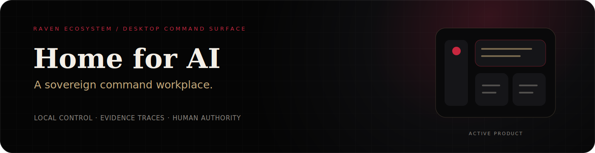
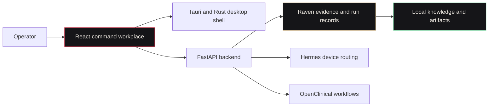

---
language:
- en
license: mit
title: Home for AI
tags:
- home-for-ai
- desktop-orchestration
- ai-agents
- local-first
library_name: custom
short_description: A local-first command workplace for coordinating agents, models, knowledge, and evidence traces.
---

<p align="center">
  
</p>

<p align="center">
  <a href="https://simpliibarrii-crypto.github.io/project.html?project=home-for-ai"></a>
  <a href="https://simpliibarrii-crypto.github.io/research.html"></a>
  <a href="LICENSE"></a>
</p>

> **Home for AI** is the desktop command surface for the Raven ecosystem. It coordinates agents, local models, knowledge, backend services, and evidence-linked run records from a Tauri, React, TypeScript, Rust, and FastAPI stack.

**Maturity:** Active product under early-stage development. It is not a certified financial product, broker, investment adviser, or production trading system.

## What it proves

- A local desktop application can present multiple AI systems as one coherent operator workspace.
- Browser showcase mode can demonstrate the interface without pretending a Tauri runtime is present.
- Raven run records can preserve evidence, token policy, replay state, and privacy-aware export metadata.
- Human authority can remain visible through review, routing, settings, and explicit runtime status.
- A product can look polished without inventing backend behaviour or unsupported maturity claims.

## Product architecture



## Repository layout

| Path | Role |
|---|---|
| `src/` | Branded React and TypeScript command interface |
| `src-tauri/` | Rust commands and desktop application wrapper |
| `backend/` | FastAPI agents, chat, market, settings, Raven records, and websocket routes |
| `docs/` | Public architecture and product documentation |
| `.github/workflows/` | Backend, frontend, Rust, and secret-scanning checks |

## Frontend showcase

```bash
npm install
npm run dev
```

The interface detects whether it is running inside Tauri. In a browser it enters an honest showcase state rather than failing desktop-only commands.

## Desktop runtime

```bash
npm install
npm run tauri:dev
```

## Backend

```bash
cd backend
python -m venv .venv
source .venv/bin/activate
pip install -r requirements.txt
DATABASE_URL=sqlite+aiosqlite:///./home_for_ai.db python main.py
```

Development endpoints:

- Health: `http://localhost:8000/health`
- API documentation: `http://localhost:8000/docs`

## Raven run records

The `/api/v1/raven` preview surface creates `home.raven_run_record.v1` records containing:

- `raven.evidence_graph.v1` sources, claims, confidence, risk, and answer traces
- draft lane, thinking level, context budget, saved context, confidence floor, verification spans, and escalation state
- replay policy and input digests
- privacy-aware redaction for private and PHI-marked local runs

This is model and inference efficiency metadata, not cryptocurrency tokenomics.

## Safety and scope

- Do not use experimental agent output for live financial decisions without appropriate legal, security, compliance, and risk review.
- Keep credentials, private filings, investor documents, personal contact drafts, and commercial strategy out of the public repository.
- Treat browser showcase behaviour as demonstration data, not a connected backend.
- Keep public claims aligned with verified product status.

## Ecosystem role

| System | Home for AI relationship |
|---|---|
| [Raven AI](https://github.com/simpliibarrii-crypto/raven-ai) | Displays evidence graphs, scientific gates, run records, and token policy |
| [Hermes Edge](https://github.com/simpliibarrii-crypto/hermes-edge) | Displays local route choices, runtime state, model profiles, and fallbacks |
| [OpenClinical AI](https://github.com/simpliibarrii-crypto/openclinical-ai) | Hosts reviewable consent-aware workflows without hiding clinical boundaries |
| [Raven BioComputer](https://github.com/simpliibarrii-crypto/simpliibarrii-crypto-raven-biocomputer) | Shows bounded biology runs, artifacts, replay state, and receipts |
| JSpace Chain | Supplies observable policy and risk snapshots for agent orchestration |

## Contributing

Start with **[accessibility, onboarding, and browser showcase tasks](https://github.com/simpliibarrii-crypto/home-for-ai/issues/48)**. Preserve the obsidian, crimson, and champagne design system and avoid fake runtime integrations.

## Public proof

- [Interactive Home for AI case study](https://simpliibarrii-crypto.github.io/project.html?project=home-for-ai)
- [Complete portfolio](https://simpliibarrii-crypto.github.io/)
- [Research archive](https://simpliibarrii-crypto.github.io/research.html)

## License

MIT. See [LICENSE](LICENSE).
