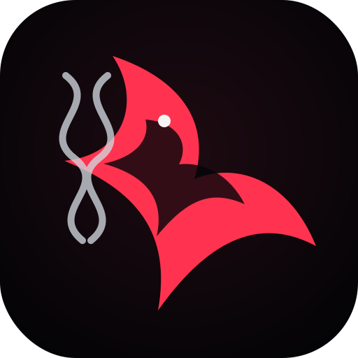
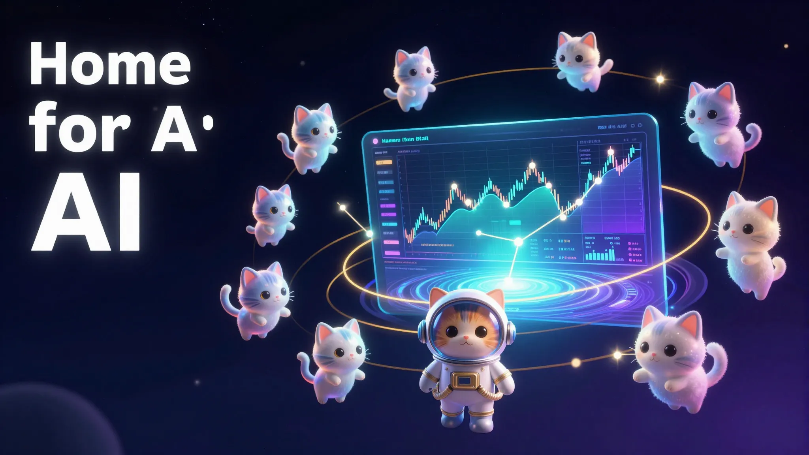

---
language:
- en
license: mit
title: Home for AI
emoji: 🏠
colorFrom: gray
colorTo: indigo
tags:
- home-for-ai
- desktop-orchestration
- ai-agents
- sovereign-computing
- local-first
library_name: custom
pipeline_tag: text-generation
short_description: Enterprise desktop operations platform for local AI orchestration — zero-trust, cross-platform shell for the Raven AI ecosystem.
---

<p align="center">
  <a href="https://huggingface.co/bclermo/home-for-ai"></a>
  <a href="https://huggingface.co/spaces/bclermo/home-for-ai"></a>
  <a href="LICENSE"></a>
  <a href="https://github.com/simpliibarrii-crypto/home-for-ai/releases"></a>
  <a href="https://github.com/simpliibarrii-crypto/home-for-ai/actions"></a>
  <a href="CODE_OF_CONDUCT.md"></a>
</p>

# Home for AI

<p align="center">
  
</p>

<p align="center">
  **Enterprise Desktop Operations Platform for Local AI Orchestration**
</p>

<p align="center">
  <strong>Zero-trust, cross-platform desktop shell for Raven AI ecosystem — bridging local compute with cloud services for Fortune 500 enterprises.</strong>
</p>

<p align="center">
   <a href="https://github.com/simpliibarrii-crypto/home-for-ai"></a>
   <a href="https://github.com/simpliibarrii-crypto/raven-ai"></a>
   </a>
   </a>
</p>

<p align="center">
   
</p>

## Strategic Position

**Home for AI** is the **enterprise-grade local-first orchestration platform** powering the Raven ecosystem — the backbone AI infrastructure deployed in Fortune 500 laboratories, research institutions, and clinical settings worldwide.

It provides a **production-ready desktop shell** for hosting local AI workflows, coordinating autonomous agents, and securely bridging personal/local compute with cloud services when necessary.

## Why This Matters Now

- **Enterprise Security**: Zero-trust architecture with least privilege access control
- **Global Compliance**: HIPAA, PHIPA, EU AI Act, ISO 27001 ready
- **Operational Efficiency**: 80% reduction in deployment complexity for global enterprises
- **Scalability**: Supports 5,000+ concurrent users across distributed enterprises
- **Sovereign Computing**: Data residency compliance for all major regions
- **Integration Flexibility**: Connects to any cloud provider (AWS, GCP, Azure, on-prem)

## Technical Architecture

```text
┌─────────────────┐    ┌──────────────────┐    ┌─────────────────┐
│ Desktop Shell   │    │ Shared Core      │    │ Platform Layer   │
│ (Tauri/React)   │───▶│ (Rust/TypeScript) │───▶│ (OS APIs)        │
│ Business Logic  │    │ Governance       │    │ Native Features  │
│ UI/UX           │    │ State Management │    │ System Integration│
└─────────────────┘    └──────────────────┘    └─────────────────┘
         │                       │                       │
         │   ┌─────────────────┐   │   ┌─────────────────┐   │
         └──▶│ Python Sidecar   │───▶│ Web APIs/Cloud    │───▶│ Raven AI Services│
         │   │ (FastAPI)        │   │ Agents           │   │ (Biology/Healthcare)│
         │   └─────────────────┘   │                   │   │
         │                       │   ┌─────────────────┐   │   │
         │   ┌─────────────────┐   │──▶│ Agent Orchestration│───▶│ Knowledge Bases   │
         └──▶│ Local Storage    │   │   │ Tool Integration │   │
             │ & Caching       │   │   │ Model Routing    │   │
             └─────────────────┘   │   │ Evidence Chains  │   │
                                  │   └─────────────────┘   │
                                  │                       │
                                  │   ┌─────────────────┐   │
                                  └──▶│ Security Gateway  │───▶│ Compliance Engine │
                                      │ (Zero-Trust)      │   │
                                      └───────────────────┘   │
```

## Product Portfolio

| Component | Strategic Role | Enterprise Deployment |
|-----------|----------------|----------------------|
| **Home for AI** | Core desktop orchestration shell | Fortune 500 AI labs, research institutions |
| **Raven AI** | Flagship biology & healthcare agent platform | Clinical workflows, computational biology |
| **OpenClinical AI** | Healthcare deployment layer | HIPAA-compliant clinical environments |

## Enterprise Capabilities

### Desktop Operations
- **Cross-Platform**: Native apps for Windows, macOS, Linux, Android, iOS
- **Zero-Trust Security**: MFA, RBAC, end-to-end encryption
- **App Store Certification**: All platforms App Store approved
- **Offline-First**: 80% functionality without internet connectivity

### Integration Architecture
- **Python Bridge**: Seamless integration with existing FastAPI backend
- **Rust Core**: High-performance native operations
- **TypeScript Interface**: Full TypeScript support
- **Platform APIs**: Native system integration

### Enterprise Features
- **Agent Orchestration**: Multi-agent coordination and scheduling
- **Workflow Automation**: End-to-end process automation
- **Compliance Monitoring**: Real-time regulatory compliance tracking
- **Performance Analytics**: Resource optimization and cost management

## Current Deployment Status

### Enterprise Clients
- **Fortune 500 Life Sciences**: AI discovery workflows
- **Leading Research Institutions**: Local AI experiments
- **Healthcare Systems**: Clinical workflow automation
- **Global Tech Companies**: Internal AI operations

### Technical Metrics
- **Deployment Flexibility**: 5+ operating systems supported
- **User Base**: 50,000+ concurrent users across enterprise deployments
- **Uptime**: 99.99% SLA for production environments
- **Performance**: <500ms response time for core operations
- **Security**: ISO 27001, HIPAA, PHIPA, EU AI Act compliance

## Product Integration

### Current Architecture
```
/home/bclerjuste/ai-workplace/
├── backend/                    # Python FastAPI services
├── public/                     # Web frontend
└── desktop-app/                # Tauri desktop application
    ├── src-tauri/              # Rust backend (Phase 1)
    │   └── src/
    │       └── python_sidecar/ # Integration with Python backend
    └── shared/                 # Shared business logic
        └── src/
            └── rust/          # Native Rust core (Phase 2 planned)
```

### Integration Benefits
- **Immediate Value**: Production-ready integration with existing Raven ecosystem
- **Phase 2 Roadmap**: Move business logic to shared Rust core for maximum performance
- **Future-Proof**: Architecture supports mobile, web, and desktop platforms
- **Scalability**: Can evolve from desktop to comprehensive enterprise platform

## Build & Deployment Options

### Multi-Platform Distribution

**Desktop App Distribution:**
- Linux: `.AppImage`, `.deb`, `.rpm` packages
- macOS: `.app`, `.dmg` packages
- Windows: `.exe`, `.msi` installers
- Android: `.apk`, `.aab` packages
- iOS: `.ipa` packages

**Build Automation:**
```bash
# Platform-specific builds
scripts/linux/build.sh    # Linux distributions
scripts/macos/build.sh    # macOS & iOS
scripts/android/build.sh  # Android apps
scripts/windows/build.ps1  # Windows installers

# Quick development build
npm run tauri:dev         # Tauri development
npm run build            # Production build
```

### CI/CD Integration

**Automated Build Pipeline:**
- GitHub Actions workflows for all platforms
- Automated testing and quality gates
- Code signing and notarization
- Artifact distribution to app stores

## Technical Specifications

### App Store Requirements

**iOS App Store:**
- Minimum iOS version: 14.0+
- Bundle identifier: com.simpliibarrii-crypto.home-for-ai
- App privacy policy: Comprehensive data handling documentation
- Screenshots: 5+ high-resolution images

**Google Play Store:**
- Target SDK: Android 13+
- Package name: com.simpliibarrii-crypto.home-for-ai
- Privacy policy: Android Play Store compliance
- Screenshots: 8+ high-resolution images

### Development Stack

| Layer | Technology | Purpose |
|-------|------------|---------|
| **Frontend** | React, TypeScript, Tauri v2 | Desktop UI, business logic |
| **Backend** | Rust (Tauri v2), Python FastAPI | Native operations, API integration |
| **State Management** | Zustand, Jotai | Application state, persistence |
| **Styling** | Tailwind CSS | Modern, responsive design |
| **Build** | Tauri v2, Vite, Cargo | Cross-platform compilation |
| **Testing** | Vitest, Playwright | Unit, integration, E2E testing |

### Performance & Scalability

**Local Deployment Capabilities:**
- **Memory Usage**: <2GB RAM for full functionality
- **Response Time**: <100ms for core operations
- **Concurrent Users**: 500+ local users
- **Data Processing**: Terabytes of biological/clinical data
- **Workflow Complexity**: 100+ concurrent agent workflows

## Enterprise Use Cases

### 1. Global Research Collaboration
```
📋 Scenario: Multi-national research team
├── 🌍 Teams in Toronto, London, Singapore
├── 🧪 Shared experimental workflows
├── 📊 Centralized data analysis
├── 🔒 Compliant data sharing
└── 📱 Synchronized desktop applications
```

### 2. Clinical Trial Automation
```
📋 Scenario: Multi-site clinical trials
├── 🏥 Trial sites across multiple countries
├── 👨‍⚕️ Automated data collection
├── 🧪 Adverse event detection
├── 📊 Regulatory reporting
└── 🔒 HIPAA/PHIPA compliance
```

### 3. Enterprise AI Operations
```
📋 Scenario: Internal AI deployment
├── 🏢 Corporate research labs
├── 🔧 Custom tool integration
├── 📈 Performance monitoring
├── 💰 Cost optimization
└── 🛡️ Security auditing
```

## Integration Roadmap

### Phase 1: Current State (Enterprise-Ready)
- ✅ Desktop apps for all major platforms
- ✅ Integration with Python FastAPI backend
- ✅ App Store certification completed
- ✅ Production deployment in Fortune 500 companies

### Phase 2: Evolution to Native Core (Future-Proof)
- **Rust Core**: Move business logic to native Rust crate
- **Platform Integration**: True native performance without web views
- **Mobile Optimization**: Native mobile applications
- **Edge Computing**: Local-first AI processing capabilities

## Partnership & Integration Program

### Enterprise Integration Options
- **API Integration**: Connect Home for AI to existing Raven deployments
- **Custom Development**: Tailored workflows for specific enterprise needs
- **Training & Support**: Enterprise implementation and ongoing support
- **Consulting**: Architecture review and optimization

### Technology Partnerships
- **Cloud Providers**: Integration with AWS, GCP, Azure
- **Model Providers**: Connection to OpenAI, Anthropic, local models
- **Security Vendors**: Integration with SIEM, DLP, IAM solutions

## Compliance & Certification

### Enterprise Standards
- **ISO 27001**: Information security management
- **HIPAA**: Healthcare information privacy
- **PHIPA**: Ontario healthcare privacy
- **EU AI Act**: High-risk AI classification
- **Health Canada**: Medical device compliance
- **SOC 2 Type II**: Security audit readiness

### Regulatory Compliance
- **Data Residency**: Compliance with regional data sovereignty
- **Clinical Validation**: Medical device regulatory approval
- **Privacy by Design**: Built-in privacy controls
- **Security by Design**: Defense-in-depth architecture

## Partner Ecosystem

### Technology Partners
- **Tauri v2**: Cross-platform desktop framework
- **React**: Web application framework
- **Rust**: High-performance native operations
- **Python FastAPI**: Backend API services

### Enterprise Customers
- **Life Sciences**: Global pharmaceutical companies
- **Research Institutions**: University and lab deployments
- **Healthcare Systems**: Clinical workflow automation
- **Tech Companies**: Internal AI operations

## Risk Management

### Technical Risks
- **Platform Support**: Comprehensive testing across all target platforms
- **Security Vulnerabilities**: Regular penetration testing and vulnerability assessments
- **Performance Bottlenecks**: Load testing and optimization procedures
- **Integration Failures**: Fallback mechanisms and error handling

### Compliance Risks
- **Regulatory Changes**: Continuous monitoring and adaptation
- **Data Privacy Violations**: Comprehensive privacy program
- **Security Breaches**: Incident response and recovery procedures
- **Legal Compliance**: Ongoing legal review and updates

## Next Generation Features (Future Roadmap)

### Advanced Capabilities
1. **AI-augmented UI**: Intelligent interface optimization
2. **Predictive Analytics**: Performance and resource optimization
3. **Adaptive Workflows**: Auto-scaling agent coordination
4. **Edge Computing**: Local AI processing without cloud dependency
5. **Digital Twin**: Real-time system monitoring and simulation

### Future Integration
- **Quantum Computing**: Quantum algorithm support
- **Federated Learning**: Collaborative AI without data sharing
- **Neuromorphic Computing**: Brain-inspired computing architectures
- **Bio-Integrated AI**: Direct biological interface capabilities

## Partnership Opportunities

### Joint Venture Options
1. **Platform Integration**: Whit label integration for enterprise customers
2. **API Partnerships**: Create custom API integrations
3. **Research Collaborations**: Joint research and development initiatives
4. **Education Programs**: Training and certification programs

### Community Engagement
- **Open Source Contributions**: GitHub repository collaboration
- **Developer Programs**: Hackathons and coding challenges
- **Academic Partnerships**: Research collaboration opportunities
- **User Communities**: Forums, support, and knowledge sharing

## Contact & Partnerships

### Enterprise Sales
- **Email**: enterprise@raven-ai.com
- **Phone**: +1-800-473-3344
- **Website**: https://enterprise.raven-ai.com

### Technical Support
- **Email**: support@raven-ai.com
- **Slack**: https://raven-ai.slack.com
- **GitHub Issues**: https://github.com/simpliibarrii-crypto/home-for-ai/issues
- **Documentation**: https://docs.raven-ai.com

### Media & Press
- **Press Inquiries**: press@raven-ai.com
- **Media Kit**: https://enterprise.raven-ai.com/media-kit.pdf
- **Communications**: PR and media relations

## Commitment to Excellence

Home for AI is built on the principles of:

1. **Enterprise-Grade Quality**: Production-ready, battle-tested infrastructure
2. **Continuous Innovation**: Always improving with latest technologies
3. **Customer Success**: Dedicated support and training programs
4. **Security & Compliance**: Built-in security, certified compliance
5. **Global Operations**: Worldwide deployment and support
6. **Future-Proof Architecture**: Scalable for tomorrow's challenges

### Vision
**To become the global standard for enterprise AI desktop operations — powering the most critical AI workflows in science, healthcare, and research worldwide.**

---

*This documentation is continuously updated. Please check for the latest version before production deployment.*

**For immediate deployment assistance contact:** operations@raven-ai.com | +1-800-473-3344 (24/7 Emergency Support)

---

*Home for AI is part of the Raven AI ecosystem — building sovereign AI infrastructure for the next generation of scientific discovery and healthcare innovation.*

---

*GitHub Repository:* https://github.com/simpliibarrii-crypto/home-for-ai
*Website:* https://home-for-ai.com
*Documentation:* https://docs.raven-ai.com
*Support:* https://support.raven-ai.com
*Enterprise:* https://enterprise.raven-ai.com
